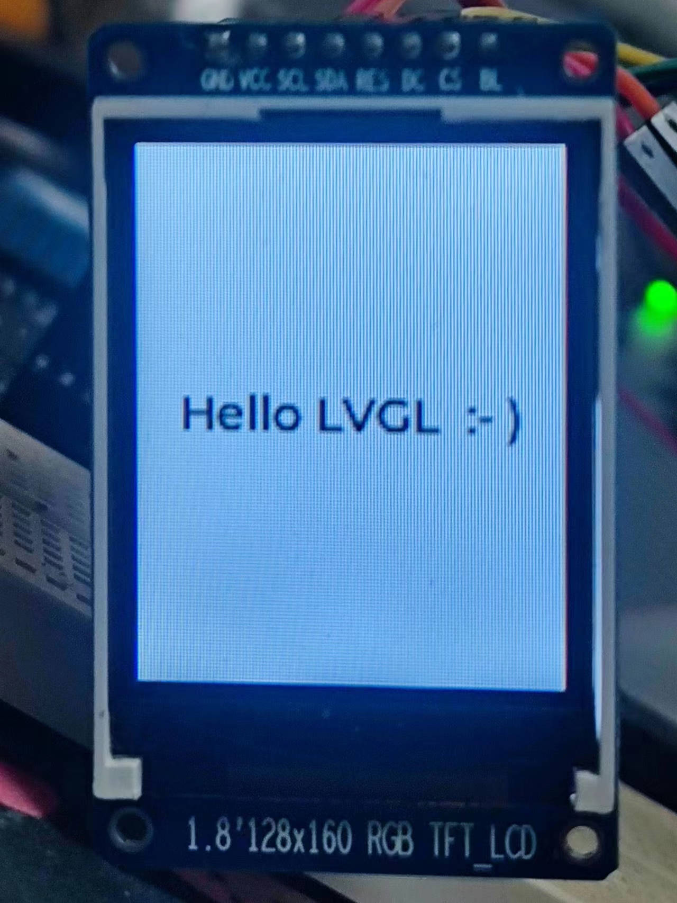

### 工程构建
#### 步骤
1. 配置好cubemx，生成makefile。
2. git添加lvgl子模块到Components文件夹。
3. 添加用户代码库，Mylibs文件夹。
4. 修改Makefile，编译lvgl/src和Mylibs下的c文件。

#### 注意事项
1. Makefile变量后面不能加注释。
2. lvgl/component.mk中的SRCDIRS，有的c文件在多级目录下，Makefile需要用`shell find`将所有c文件都查出来编译。

### lvgl和lcd移植
#### 步骤
1. lvgl源码：<https://github.com/lvgl/lvgl>。
2. 软件移植lvgl，提供时间戳的1ms中断，周期调度，初始化lvgl。
3. lvgl参数配置。
4. lcd驱动参考：[lvgl_esp32_drivers](https://github.com/lvgl/lvgl_esp32_drivers)，自己移植下mcu驱动。
5. lcd驱动与mcu驱动分离，方便换lcd驱动芯片只移植lcd驱动层。
6. lcd参数配置。

#### 注意事项
1. lcd初始化后未往屏幕中写要显示的内容会出现花屏，属于正常现象，lcd内部ram上电后随机。
2. 我调试的lcd ram不随硬复位和软复位重置，下次初始化后没刷图则还会显示上次的图。
3. 行列有部分边上区域不显示，首次上电刷图后边上还是花屏现象，需调整行列偏移配置。
4. 每行像素都显示错位可能是lvgl配置的行列和屏幕配置的横竖不对应。
5. 显示颜色有问题，可能是屏幕配置了颜色翻转，或者lvgl配置的rgb565 2字节大小端错误。

### 移植成功屏幕显示
